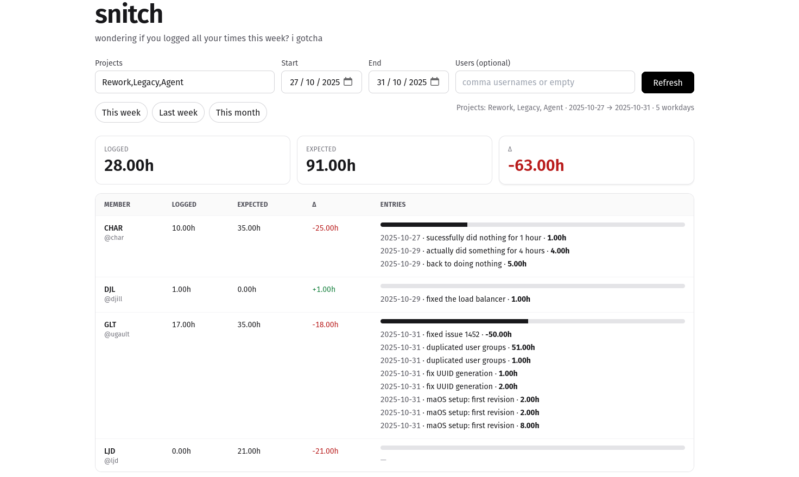

# SNITCH

Snitch tracks team members' logged times on our Taiga project. It fetches user story updates and calculates how much time each team member has logged on their tasks. This could be adapted to work with other Taiga projects but currently relies on a specific custom attribute in user stories to log time spent.

This project's goal is to provide a simple page for everyone (except management ;)) to see if they have logged their expected hours for the week and replace the old wonky script I used to run every Friday.

## Setup
1. Clone the repository.
2. Create a virtual environment and install dependencies:
    ```bash
    python3 -m venv snitch-env
    source snitch-env/bin/activate
    pip install -r requirements.txt
    ```
3. Configure the `config.yml` file with your Taiga credentials, team members, and project details.
4. Run the server:
    ```bash
    TDASH_CONFIG=./config.yml uvicorn server:app --reload --port 8000
    ```
5. Open your browser and navigate to `http://localhost:8000` to view the dashboard.

## Configuration
The `config.yml` file contains all necessary configurations and is pretty much explicit. 

Since I didn't have access to every single project, we decided to allow members to provide their own token. By default the app will use the "default" credentials to fetch data if no user-specific credentials are found. This is obviously highly specific and insecure, in a scaled up scenario you would want to have an dedicated account with read-only access to all projects.

## TODO:
- Change project selection field (use a multi-select dropdown probably)
- Improve styling overall
- Double check time calculations (seems like some us/tasks are not counted properly)
- I want visualisations (graphs/charts)
- Also could add an hover tooltip on the usernames to allow quick configurations edits (time expectations)

## Dashboard
